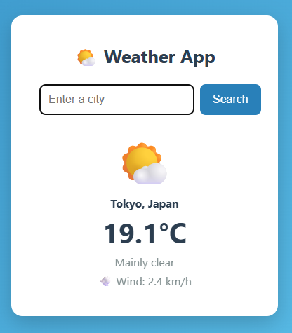

# 🌤️ Weather App

A simple web app that shows the **current weather** for any city in the world.
Type a city name and get the live temperature, conditions, and wind speed —
powered by a real weather API.

> **Live demo:** _coming soon (added after deployment in the next step)_



---

## ✨ Features

- 🔍 Search the weather for any city in the world
- 🌡️ Live temperature, conditions, and wind speed
- ☀️🌧️❄️ Weather emoji that matches the current conditions
- ⚠️ Friendly message when a city can't be found
- 📱 Clean, responsive design that works on mobile

## 🛠️ Built With

- **Python** + **[Flask](https://flask.palletsprojects.com/)** — backend / web server
- **HTML & CSS** — frontend
- **[Open-Meteo API](https://open-meteo.com/)** — free live weather data (no API key needed)
- **[Requests](https://requests.readthedocs.io/)** — calling the API from Python

## 🚀 Run It Locally

```bash
# 1. Clone the repo
git clone https://github.com/bsleong-code/weather-app.git
cd weather-app

# 2. Create and activate a virtual environment
python -m venv venv
venv\Scripts\activate        # On Mac/Linux: source venv/bin/activate

# 3. Install the dependencies
pip install -r requirements.txt

# 4. Run the app
python app.py
```

Then open **http://127.0.0.1:5000** in your browser.

## 📚 What I Learned

This was one of my first web projects. Building it, I learned how to:

- Build a web server and routes with Flask
- Send a form's input from the browser to Python (GET vs POST requests)
- Call an external REST API and parse JSON responses
- Chain two API calls (geocoding → weather) to turn a city name into a forecast
- Render dynamic data into HTML with Jinja templates
- Handle errors gracefully (e.g. an unknown city)
- Style a page with CSS and deploy it live

## 📝 License

Free to use for learning. Built by [bsleong-code](https://github.com/bsleong-code).
